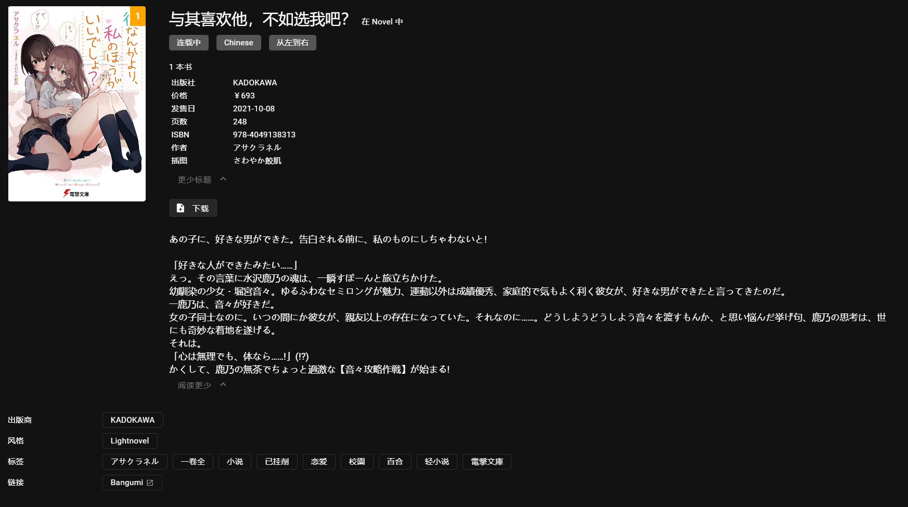
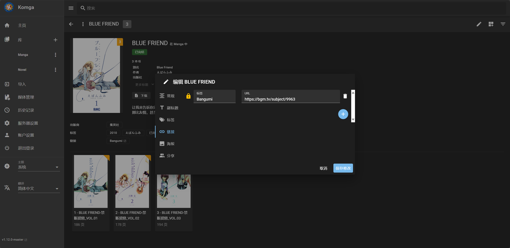

### 效果图如下

### 用法

Bgm Token 申请 https://next.bgm.tv/demo/access-token

将程序与 config.json 放在同一目录下

完善 config.json 后直接运行程序即可

### Tips
基于Komga内系列标题进行精准识别，如果没有识别出对应条目请检查标题或手动填入Bangumi链接

目前识别成功的系列会覆盖原有的**概要、状态、出版商、副标题、标签、链接**，如果特定书籍不想被挂削请在标签中添加 `已挂削`

### 常见问题
Q: 没法通过Bangumi识别到对应的条目
A: 手动添加链接后再次运行即可

Q: 重新挂削条目？
A: 删除komga标签 `已挂削` 即可

### 其他项目推荐
A Metadata Provider for Komga using Bangumi https://github.com/chu-shen/BangumiKomga ，支持挂削单本书籍元数据并且同步进度至Bangumi